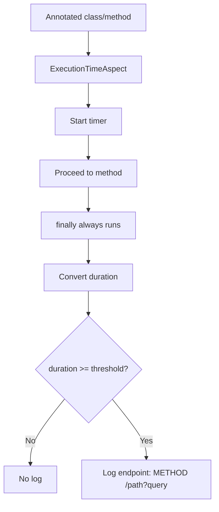

# Developer README: API Execution Tracker

[](#environment)
[](#compatibility)
[](#build--verify)
[](LICENSE)

API Execution Tracker is a Spring Boot starter that measures and logs endpoint execution time using AOP and a single annotation.

> [!WARNING]
> This dependency supports **Spring Boot 4+ only**.
> It is **not compatible with Spring Boot 3.x**.


## Environment

| Tool | Minimum |
|---|---|
| Java  | `21+` |
| Maven | `3.8+` |
| Git | Current stable |


## Architecture At A Glance

Request-driven API flow (controller/service calls inside an active HTTP request):




## Logging Semantics

| Scenario | What gets logged |
|---|---|
| Annotated controller method | Endpoint path (`GET /api/...`) |
| Annotated service method called by controller | Still endpoint path (`GET /api/...`) |
| Exception thrown in method/request flow | Timing log still emitted (`finally` block) |

For typical API usage, treat this as endpoint-level timing rather than per-method signature timing.


## Source Layout

```text
src/main/java/io/github/sathwikhbhat/apiexecutiontracker
├── annotation
│   └── TrackExecutionTime.java                 # Marker annotation used on class/method
├── aspect
│   └── ExecutionTimeAspect.java                # @Around advice: start timer -> proceed -> finally log
├── autoconfig
│   └── ExecutionTrackerAutoConfiguration.java  # Registers aspect when tracker.enabled=true
└── config
    ├── TrackerProperties.java                  # Binds tracker.enabled, tracker.time-unit, tracker.threshold
    └── TimeUnitType.java                       # Enum of allowed time units

src/main/resources
└── META-INF/spring
    └── org.springframework.boot.autoconfigure.AutoConfiguration.imports
                                                # Tells Spring Boot to load this starter's autoconfiguration
```

Working flow:
1. `AutoConfiguration.imports` exposes `ExecutionTrackerAutoConfiguration` to Spring Boot.
2. `ExecutionTrackerAutoConfiguration` creates `ExecutionTimeAspect` if `tracker.enabled` is true.
3. `ExecutionTimeAspect` intercepts `@TrackExecutionTime`, measures duration, applies unit conversion + threshold, then logs endpoint timing.


## Publishing

| Item | Value |
|---|---|
| Signing plugin | `org.apache.maven.plugins:maven-gpg-plugin` |
| Signing phase | `verify` |
| Central publishing plugin | `org.sonatype.central:central-publishing-maven-plugin` |
| Publishing server id | `central` |

Official dependency page: [Maven Central Repository: API Execution Tracker](https://central.sonatype.com/artifact/io.github.sathwikhbhat/api-execution-tracker)


## Contributing
1. Create a feature/fix branch.
2. Run `mvn clean package` (or `mvn clean install -Dgpg.skip=true` locally).
3. Open a PR with a short summary of what changed.
